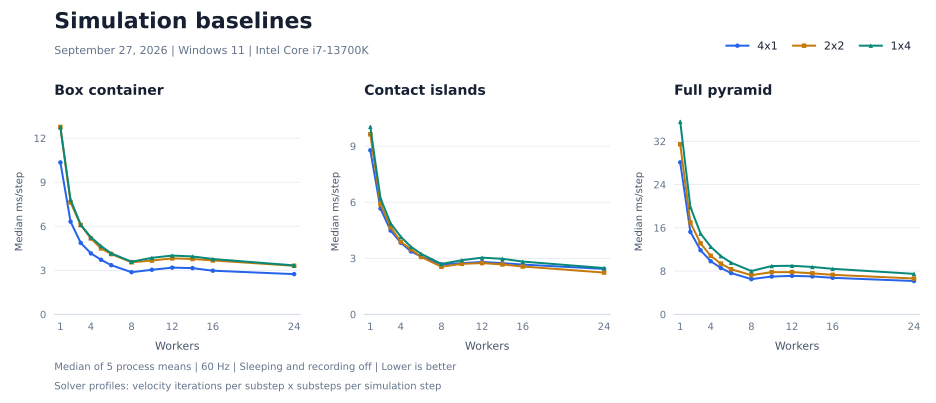

# Benchmarks

Published Entasis performance baselines, measured on Windows 11 with an Intel Core i7-13700K and 24 logical processors. Worker counts include the caller and CPU placement is unpinned. Compiler identity and measurement date belong to each dated result set

## Simulation baselines

September 27, 2026, using the contact-optimized engine and Odin `dev-2026-09-nightly:a2fb372`, Release `-o:speed`, `x86-64-v3`, with bounds checks and assertions disabled

The current baseline covers Box Container, Contact Islands and Full Pyramid at 4x1, 2x2 and 1x4. All nine profiles explicitly disable sleeping and recording. Each table entry is the median of five process mean step times, in milliseconds per step. Lower is better. These are not individual-frame latency percentiles

Each profile retains five raw samples at workers 1, 2, 3, 4, 5, 6, 8, 10, 12, 14, 16 and 24

### Solver profiles

The notation is **velocity iterations per substep x substeps per simulation step**. Every simulation step advances 1/60 second

| Profile | Velocity iterations per substep | Substeps per 60 Hz step | Run options                            |
| ------- | ------------------------------: | ----------------------: | -------------------------------------- |
| 4x1     |                               4 |                       1 | `--velocity-iterations 4 --substeps 1` |
| 2x2     |                               2 |                       2 | `--velocity-iterations 2 --substeps 2` |
| 1x4     |                               1 |                       4 | `--velocity-iterations 1 --substeps 4` |

All profiles perform four velocity iterations across the full step, but their substep work and resulting trajectories differ. Equal iteration totals do not establish equal performance or accuracy. The existing default remains 4x1, and the other profiles are explicit alternatives



Bold values mark the lowest observed median among the three profiles at the same worker count, without implying a statistically resolved ordering

### Box container

| Workers |   4x1 ms/step | 2x2 ms/step | 1x4 ms/step |
| ------: | ------------: | ----------: | ----------: |
|       1 | **10.347018** |   12.761452 |   12.748119 |
|       2 |  **6.313046** |    7.624662 |    7.809493 |
|       3 |  **4.867344** |    6.078345 |    6.102437 |
|       4 |  **4.153797** |    5.169785 |    5.251157 |
|       5 |  **3.715510** |    4.493097 |    4.653638 |
|       6 |  **3.349080** |    4.107351 |    4.150579 |
|       8 |  **2.872174** |    3.545752 |    3.586410 |
|      10 |  **3.034352** |    3.664513 |    3.850454 |
|      12 |  **3.182395** |    3.812391 |    4.004593 |
|      14 |  **3.148892** |    3.771288 |    3.943334 |
|      16 |  **2.972920** |    3.672388 |    3.768768 |
|      24 |  **2.738088** |    3.304977 |    3.331770 |

Reports and raw samples: [4x1](results/container/box-4x1-awake/2026-09-27/README.md), [2x2](results/container/box-2x2-awake/2026-09-27/README.md), [1x4](results/container/box-1x4-awake/2026-09-27/README.md)

### Contact islands

| Workers |  4x1 ms/step |  2x2 ms/step | 1x4 ms/step |
| ------: | -----------: | -----------: | ----------: |
|       1 | **8.780762** |     9.639913 |   10.036811 |
|       2 | **5.662878** |     5.900524 |    6.216592 |
|       3 | **4.481518** |     4.665508 |    4.870748 |
|       4 | **3.831368** |     3.883836 |    4.154191 |
|       5 | **3.365430** |     3.476117 |    3.615868 |
|       6 |     3.094042 | **3.071698** |    3.238050 |
|       8 |     2.676649 | **2.547864** |    2.698150 |
|      10 |     2.740410 | **2.701932** |    2.897382 |
|      12 |     2.803748 | **2.743643** |    3.034015 |
|      14 |     2.740498 | **2.670759** |    2.972960 |
|      16 |     2.663297 | **2.558937** |    2.824561 |
|      24 |     2.431708 | **2.235791** |    2.476813 |

Reports and raw samples: [4x1](results/contact_islands/box-4x1-awake/2026-09-27/README.md), [2x2](results/contact_islands/box-2x2-awake/2026-09-27/README.md), [1x4](results/contact_islands/box-1x4-awake/2026-09-27/README.md)

### Full pyramid

| Workers |   4x1 ms/step | 2x2 ms/step | 1x4 ms/step |
| ------: | ------------: | ----------: | ----------: |
|       1 | **28.108629** |   31.440918 |   35.620657 |
|       2 | **15.243167** |   16.968097 |   19.827994 |
|       3 | **11.852377** |   13.126816 |   14.938140 |
|       4 |  **9.819090** |   10.815479 |   12.501634 |
|       5 |  **8.564632** |    9.373924 |   10.767997 |
|       6 |  **7.640974** |    8.339649 |    9.555969 |
|       8 |  **6.509744** |    7.240036 |    8.005019 |
|      10 |  **6.991403** |    7.804723 |    8.933427 |
|      12 |  **7.109722** |    7.805863 |    8.981039 |
|      14 |  **7.017965** |    7.585698 |    8.759080 |
|      16 |  **6.751774** |    7.304892 |    8.417103 |
|      24 |  **6.155543** |    6.624692 |    7.485239 |

Reports and raw samples: [4x1](results/pyramid/box-4x1-awake/2026-09-27/README.md), [2x2](results/pyramid/box-2x2-awake/2026-09-27/README.md), [1x4](results/pyramid/box-1x4-awake/2026-09-27/README.md)

### Physical validation

These timings do not establish penetration, resting-jitter or full-trajectory accuracy. Pyramid post-impact dispersal beyond the finite floor does not rank contact accuracy

## Ragdoll Stair-Tumble

September 13, 2026, using Odin `dev-2026-09:c59786ce8` on the same Windows 11/i7-13700K host with DDR5-4800, using the 4x1 solver. Values are medians of five process mean step times, in milliseconds per step. Lower is better

| Workers | Median ms/step |
| ------: | -------------: |
|       1 |       6.662286 |
|       2 |       4.326049 |
|       3 |       3.518923 |
|       4 |       2.993225 |
|       5 |       2.638809 |
|       6 |       2.461467 |
|       8 |       2.132619 |
|      10 |       2.243594 |
|      12 |       2.295174 |
|      14 |       2.287193 |
|      16 |       2.259717 |
|      24 |       2.270396 |

[Report and raw samples](results/ragdoll_stair_tumble/ap5-20260913/README.md)

## Query results

September 10, 2026, using Odin `dev-2026-09:c59786ce8`. Values are medians of five process throughput measurements. Higher is better. Ray batches are in millions of rays per second, and mixed queries are in millions of queries per second

| Workers | Closest-ray batches (M rays/s) | Mixed spatial queries (M queries/s) |
| ------: | -----------------------------: | ----------------------------------: |
|       1 |                      10.235456 |                           11.839490 |
|       2 |                      20.424895 |                           23.492984 |
|       3 |                      30.232598 |                           34.454779 |
|       4 |                      39.885226 |                           46.067898 |
|       5 |                      49.702827 |                           55.747730 |
|       6 |                      59.085103 |                           65.585554 |
|       8 |                      76.117983 |                           84.144628 |
|      10 |                      64.728438 |                           72.491346 |
|      12 |                      72.432800 |                           83.453506 |
|      14 |                      84.365119 |                           92.670333 |
|      16 |                      96.633296 |                          106.287207 |
|      24 |                     136.785807 |                          157.396040 |

Reports and raw samples: [Closest-ray batches](results/spatial_query_batch/cooperative-wait-20260910-d2/README.md), [Mixed spatial queries](results/spatial_query_trace/2026-09-10/README.md)

See the [closest-ray workload](benchmarks/spatial_query_batch/README.md) for its scene, batch sizes and timing details

## Workloads and timing

The simulation fixtures use 60 Hz, gravity `(0, -10, 0)` and zero damping. The September 27 baselines use the three solver profiles above. The Ragdoll Stair-Tumble baseline uses 4x1

- **Ragdoll Stair-Tumble:** 512 fifteen-body ragdolls, 7,168 ball sockets, 64 stairs and four catch-basin statics, with linked-body collisions enabled. A disposable world runs 30 warmup steps, then a fresh world runs 600 measured steps
- **Box Container:** 10,000 dynamic boxes in a 25 x 16 x 25 pile, five static colliders and sleeping disabled. A disposable world runs 30 warmup steps, then a fresh world in the same pool runs 300 measured steps
- **Contact Islands:** 10,000 dynamic boxes in 50 stacks of 5 x 8 x 5, 50 static floors and sleeping disabled, with components common. The same world runs 30 warmup steps and then 300 measured steps
- **Full Pyramid:** 16,206 cubes, four sphere projectiles and one floor, with sleeping disabled in the current baseline. The fixture default uses sleeping enabled. No warmup and 600 measured steps, with projectile launch inside step index 120
- **Closest-ray batches:** 50,000 closest rays per frame through `entasis.query_batch`, in batches of 256. Ten warmup frames and 100 measured frames
- **Mixed spatial queries:** 10,000 static boxes and 100,000 queries per batch: 50,000 closest rays, 25,000 sphere casts with radius 0.5 and 25,000 AABB overlap-presence queries. Ten warmup batches and 100 measured batches

Simulation timing excludes setup, warmup, validation and teardown. Box Container times the whole step loop. Contact Islands, Ragdolls and Pyramid sum per-step times, including Pyramid's launch work. Divide each process total by its measured step count before taking the median

Query timing includes submission, output writes, hit counting and dispatch. Setup, allocation, warmup and result validation are outside timing. The ray report records elapsed milliseconds for all measured frames. Throughput is `ray_query_count * measured_batches / (ray_elapsed_ms * 1000)` in millions of rays per second. Mixed-query CSVs record throughput in `queries_per_second`

## Reproduction

The [physics viewer](tools/physics_viewer/README.md#replay) reads saved CSVs without executing workloads. The September 27 baselines use recording Off and have no associated replay. Visual frame times are not benchmark measurements

Run from the repository root in PowerShell 7 on an otherwise idle machine. Explicit Build uses the declared compiler selection described in [Building](docs/BUILDING.md#toolchain-selection). Select the measured compiler and source to reproduce a dated baseline. Run uses the prepared producer and reporter without discovering a compiler

The following commands measure five processes per worker for each solver profile, with explicit sleeping, recording, warmup and measured-step conditions

```powershell
$settings = @{
    Configuration = 'Release'
    Runs = 5
    Workers = '1,2,3,4,5,6,8,10,12,14,16,24'
    TimeoutSeconds = 900
    Sleep = 'disabled'
    Record = 'Off'
    TimestepHz = 60
}
$profiles = @(
    @{ Name = '4x1'; Iterations = 4; Substeps = 1 },
    @{ Name = '2x2'; Iterations = 2; Substeps = 2 },
    @{ Name = '1x4'; Iterations = 1; Substeps = 4 }
)
.\scripts\windows\benchmarks\build_benchmarks.ps1 -Configuration Release -Package container -Record Off
.\scripts\windows\benchmarks\build_benchmarks.ps1 -Configuration Release -Package contact_islands -Components Common -Record Off
.\scripts\windows\benchmarks\build_benchmarks.ps1 -Configuration Release -Package pyramid -Record Off
foreach ($profile in $profiles)
{
    $solver = @{
        Shape = 'box'
        Variant = "box-$($profile.Name)-awake"
        VelocityIterations = $profile.Iterations
        Substeps = $profile.Substeps
    }
    .\scripts\windows\benchmarks\run_benchmark.ps1 @settings @solver -Package container -Steps 300 -WarmupSteps 30
    .\scripts\windows\benchmarks\run_benchmark.ps1 @settings @solver -Package contact_islands -Components Common -Steps 300 -WarmupSteps 30
    .\scripts\windows\benchmarks\run_benchmark.ps1 @settings @solver -Package pyramid -Steps 600 -WarmupSteps 0
}
```

The 900-second ceiling applies to each selected profile's measurement and reporting phase. Build is outside that clock. Successful runs write CSVs and a report under `build/benchmark-results/windows_amd64/`. Each attempt gets a fresh `<attempt>.pending/` directory and publishes as `<attempt>/` only after samples, recordings and reporting succeed. Failed attempts and earlier completed runs are retained

Ragdoll and query workloads retain separate dated results. Their native Build/Run package names are `ragdoll_stair_tumble`, `spatial_query_batch` and `spatial_query_trace`. Solver-profile and sleeping overrides above apply to the three configurable simulation workloads

## Linux runs and result promotion

Linux Build uses the declared compiler selection by default, with an optional build-only `--odin <absolute-native-executable>` override. Linux Run requires prepared executables and no compiler

```sh
./scripts/linux/benchmarks/build_benchmarks.sh --package container --configuration release --record off
./scripts/linux/benchmarks/run_benchmark.sh \
    --package container --shape box --variant box-default \
    --runs 5 \
    --workers 1,2,3,4 \
    --configuration release
```

Successful runs publish raw worker CSVs and `README.md` in a new `build/benchmark-results/linux_amd64/<package>/<variant>/<configuration>/<attempt>/`. Failed work remains in its unique `<attempt>.pending/` directory. Promote an accepted Release result explicitly:

```sh
./scripts/linux/benchmarks/promote_benchmark.sh --package container --variant box-default --name accepted-result-name \
    --run-directory build/benchmark-results/linux_amd64/container/box-default/release/COMPLETED-ATTEMPT
```

PowerShell scripts provide the Windows equivalent. Explicit Build compiles the selected producer and matching reporter. Run uses the prepared binaries without checking source or toolchain freshness, so rebuild explicitly after either changes. Missing binaries name the required Build command before any result directory or workload is created. Compiler provenance in new reports is unavailable for the prepared binary, while source metadata embedded during Build is preserved

Windows `contact_islands`, `custom_extensions` and `query_extensions` artifacts end in `_common.exe` or `_all.exe` in Release, Development and recorded paths. For example, `build/benchmarks/entasis_contact_islands_all.exe` and `build/benchmarks/recorded/release/contact_islands_common.exe`. Build and Run for the same selected artifacts must run sequentially

`BENCHMARK_PREPARED` covers native script entry, shared initialization, admission and result preparation. `BENCHMARK_STAGE stage=report workload_ms=` covers the sample phase, including setup, warmup, recording and bookkeeping. `BENCHMARK_REPORT` covers reporting, while `BENCHMARK_ELAPSED` covers the sample and reporting phases. None is pure physics time. GUI Total elapsed also includes host startup and, for Build and benchmark, compilation

Promotion copies `README.md`, `workers-*.csv` and their declared finalized recordings into `results/<package>/<variant>/<name>/`, leaving process logs in ignored build output. It never overwrites an existing destination

Compare builds on the same machine with the same compiler, flags, affinity, workload, warmup and timed region

## Configurable workloads

`container`, `contact_islands`, and `pyramid` require `--shape box|sphere|capsule|cylinder|hull` and `--variant`. Static floors and walls use `--static-shape box|hull`, defaulting to box. Hulls are cooked eight-corner cuboids. Pyramid projectiles remain spheres

Common options are `--shape-size X,Y,Z` (full dimensions), `--density`, `--layout-scale`, `--steps`, `--timestep-hz`, `--warmup-steps`, `--velocity-iterations`, `--substeps` and `--sleep enabled|disabled`

Shape dimensions must satisfy these rules:

- Sphere: X=Y=Z
- Cylinder: X=Z
- Capsule: X=Z and Y>X. Radius is X/2 and cylindrical length is Y-X

Default sizes match each fixture's cube. Capsules use half its X/Z size. Layout scale multiplies default lengths and positions. Explicit dimensions and positions are absolute overrides. Shapes do not auto-pack or resize floors

Container and islands accept `--grid X,Y,Z`, `--spacing X,Y,Z` and `--spawn-height Y`

- Container also accepts `--container-size X,Y,Z`: floor width, wall height and floor depth, defaulting to 29,24.5,29
- Islands also accepts `--island-grid X,Z`, `--island-spacing X,Z` and `--floor-size X,Y,Z`. Initially overlapping island floors are rejected

Pyramid accepts `--floor-size`, `--rows`, `--projectile-count`, `--launch-step`, `--projectile-radius`, `--projectile-density`, `--projectile-center X,Y,Z`, `--projectile-spacing X,Y,Z` and `--projectile-velocity X,Y,Z`

Zero projectiles disables launch. Otherwise the zero-based launch index must precede the measured step count. Pyramid warmup must be zero. A small Sphere Pyramid configuration previously exhausted the parallel broad-phase job buffer at two workers and remains unsupported by the recorded checks

Input limits:

- Dynamic bodies, measured/warmup steps, and positive timing/solver integers: at most 1,000,000
- Scalar values: decimal syntax, at most 64 characters, representable as finite f32
- Dimensions, density and scale: positive
- Derived placement, mass, inertia and capacity arithmetic: representable

Invalid, duplicate, unknown and inapplicable options are rejected before physics allocation

Container uses a disposable warmup world and measures a fresh world in the same pool, timing the whole loop. Contact islands warms and measures the same world with per-step timing. Pyramid includes its scheduled launch in per-step timing. Reports record effective settings in `benchmark_parameters` and reject mismatched samples

Variant names use `[A-Za-z0-9][A-Za-z0-9._-]*`. Each variant retains its own completed attempts. Promotion requires the variant for configurable workloads. Other packages omit it from the result path

## Extension workloads

[Extension benchmark definitions](benchmarks/EXTENSIONS.md) cover custom callbacks, query contexts and distance/separation, allocation/lifecycle, and optional trigger/restitution/body-control costs. The Windows runner accepts `-Components Common` or `-Components All` for `custom_extensions`, `query_extensions` and `contact_islands`. Common workloads run on the original engine, while all adds separately reported feature groups. These are native Odin workloads. The dated published results above remain their original measurements

## Optional playback recording

`--record off|on` (PowerShell `-Record Off|On`) selects distinct producer artifacts. CLI and fresh/reset GUI launches default Off. Save replay exposes explicit Off/On segments for supported cases. Container, baseline contact islands, pyramid, ragdoll stair tumble, noncontact constraint mix and noncontact fallback smoke record the actual measured world. Other packages reject On

On accepts `--compression lz4|lz4hc` and `--memory-mib 64..16384`, defaulting to LZ4 and 512 MiB. Each worker/repeat owns a fresh finalized recording. The CSV's relative `recording_path` and `recording_component` associate it with the exact sample. Missing legacy fields mean unavailable playback

`recording_mode` and `timing_method` keep capture conditions distinct. Off preserves existing timing. On captures outside complete native-step intervals. Container and the two noncontact producers switch from `whole_loop` to `native_step_sum`. Capture still affects cache, memory and total runtime. Reporter ingestion rejects incompatible conditions

Contact-islands recordings cover baseline `physics_elapsed_ms`, not the extra component measurements. A median has no recording

The [physics viewer](tools/physics_viewer/README.md#benchmark-launch-and-recordings) offers Build and benchmark to compile before running, or Benchmark to use prepared binaries directly. Both keep the same window open with progress, cancellation and diagnostic output, then open the completed result
